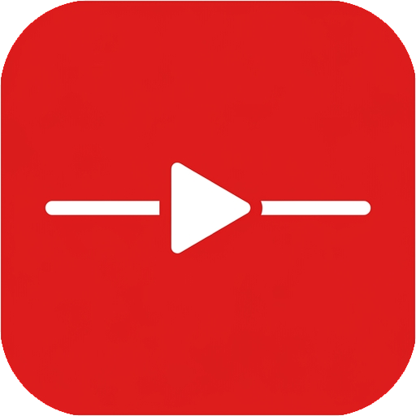

<p align="center">
  
</p>

<h1 align="center">YouTube Control</h1>
<p align="center"><b>Shorts Blocker & Detox</b></p>
<p align="center"><i>A beautiful, premium, and distraction-free browser extension that helps you reclaim your focus on YouTube.</i></p>

<p align="center">
  
  
  
</p>

---

## Key Features

| Category | Feature | Description |
| :--- | :--- | :--- |
| 📊 **Focus Tracking** | **Calm Meter** | A visual progress ring showing how focus-friendly your configuration is. |
| 👁️ **Visual Detox** | **Blur Thumbnails** | Blurs thumbnail images until hovered to prevent clickbait trap. |
| 🎨 **Styling** | **Black & White Mode** | Makes the entire YouTube interface grayscale to reduce visual stimulation. |
| ⚙️ **Custom Hiding** | **Clutter Control** | Hide comments, recommended sidebar, home feed, search, and more. |
| 📐 **Layouts** | **Sticky Player** | Locked scrolling with independent panels for comments and player. |
| 📺 **Modes** | **Mini Fullscreen** | Fills the viewport while keeping search, tabs, and bookmarks active. |
| 📸 **Utilities** | **Video Screenshot** | Capture clean video frames instantly as high-quality PNGs with one click. |

---

## Folder Structure

```text
youtube control/
├── CHANGELOG.md      # History of version updates
├── build.py          # Script to minify code and create Firefox/Chrome packages
├── src/              # Source code directory (where you make edits)
│   ├── manifest.json # Extension configuration blueprint
│   ├── popup.html    # Settings panel interface
│   ├── popup.css     # Settings panel visual styling (Calm Obsidian dark theme)
│   ├── popup.js      # Settings panel controller logic & Calm Meter animation
│   ├── content.js    # Script injecting class tags into YouTube
│   └── content.css   # Hiding styles injected into YouTube
├── dist/             # Minified, ready-to-load Chrome/Edge build (Generated)
└── firefox/          # Minified, ready-to-load Firefox build (Generated)
```

---

## Getting Started

### 1. Build the Extension

To compile and compress the source code into optimized browser folders, run this command in your command terminal:

```bash
python build.py -y
```

### 2. Loading the Extension

> [!TIP]
> **Loading in Google Chrome / Chromium (Edge, Brave, Opera):**
> 1. Open `chrome://extensions/` in your browser.
> 2. Turn on the **Developer mode** toggle in the top-right corner.
> 3. Click the **Load unpacked** button in the top-left corner.
> 4. Select the **`dist`** folder inside this directory.

> [!NOTE]
> **Loading in Mozilla Firefox:**
> 1. Open `about:debugging#/runtime/this-firefox` in your browser.
> 2. Click the **Load Temporary Add-on...** button.
> 3. Select the `manifest.json` file inside the **`firefox`** folder inside this directory.

---

## Previews & Screenshots

<p align="center">
  <b>Settings Menu (Popup Interface)</b><br>
  
</p>

<br>

<p align="center">
  <b>Split Scroll Pane Layout</b><br>
  
</p>

<br>

<p align="center">
  <b>Mini Fullscreen Layout</b><br>
  
</p>
