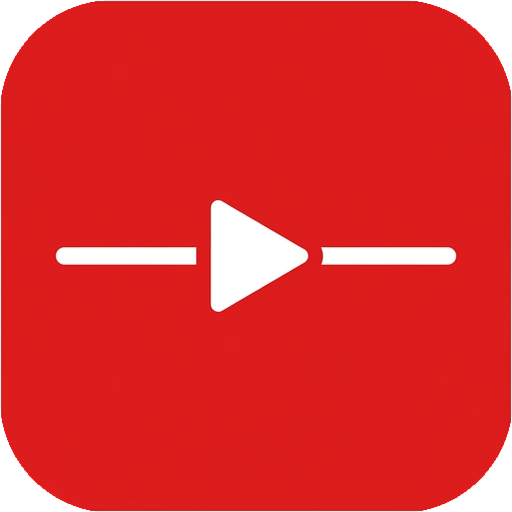

<p align="center">
  
</p>

<h1 align="center">YouTube Control</h1>
<p align="center"><b>Shorts Blocker & YouTube Detox Extension</b></p>
<p align="center"><i>Hide Shorts, clean up video clutter, and customize your YouTube layout for focused watching.</i></p>

<p align="center">
  <a href="https://github.com/vishwa-vsr/YouTube-Control/blob/master/LICENSE"></a>
  <a href="https://github.com/vishwa-vsr/YouTube-Control/issues"></a>
  <a href="https://github.com/vishwa-vsr/YouTube-Control/pulls"></a>
</p>

---

## What is YouTube Control?

YouTube Control is a lightweight browser extension that strips away distractions and gives you control over YouTube's user interface. 

* **No tracking or analytics** — 100% of your preferences stay on your device.
* **No external servers** — runs entirely locally inside your browser.
* **No account required** — install and use instantly.
* **Manifest V3 compliant** — built for modern Chromium and Firefox browsers.

---

## 📥 Store Downloads

| Browser Store | Version | Rating | Active Users |
| :--- | :---: | :---: | :---: |
| [Chrome Web Store](https://chromewebstore.google.com/detail/youtube-control-shorts-bl/ljinlboeiainceejndpicabkmheecnfj?hl=en-GB&authuser=0) | [](https://chromewebstore.google.com/detail/youtube-control-shorts-bl/ljinlboeiainceejndpicabkmheecnfj?hl=en-GB&authuser=0) | [](https://chromewebstore.google.com/detail/youtube-control-shorts-bl/ljinlboeiainceejndpicabkmheecnfj?hl=en-GB&authuser=0) | [](https://chromewebstore.google.com/detail/youtube-control-shorts-bl/ljinlboeiainceejndpicabkmheecnfj?hl=en-GB&authuser=0) |
| [Firefox Add-ons](https://addons.mozilla.org/en-US/firefox/addon/youtube-control/) | [](https://addons.mozilla.org/en-US/firefox/addon/youtube-control/) | [](https://addons.mozilla.org/en-US/firefox/addon/youtube-control/) | [](https://addons.mozilla.org/en-US/firefox/addon/youtube-control/) |
| [Microsoft Edge Add-ons](https://microsoftedge.microsoft.com/addons/detail/youtube-control-shorts-b/fnimgjdbnocikpjnokpoepgajbaagfki) | [](https://microsoftedge.microsoft.com/addons/detail/youtube-control-shorts-b/fnimgjdbnocikpjnokpoepgajbaagfki) | [](https://microsoftedge.microsoft.com/addons/detail/youtube-control-shorts-b/fnimgjdbnocikpjnokpoepgajbaagfki) | [](https://microsoftedge.microsoft.com/addons/detail/youtube-control-shorts-b/fnimgjdbnocikpjnokpoepgajbaagfki) |

---

## Screenshots

<p align="center">
  <b>Settings Popup</b><br>
  
</p>

<p align="center">
  <b>Dual Scrolling Layout (Dock Comments to Sidebar)</b><br>
  
</p>

<p align="center">
  <b>Mini Fullscreen Mode</b><br>
  
</p>

---

## Features

| Category | Feature | Description |
| :--- | :--- | :--- |
| 🚫 **Shorts & Feeds** | **Hide Shorts** | Removes Shorts shelves, navigation buttons, channel reels, and sidebar recommendations. |
| 🚫 **Shorts & Feeds** | **Hide Home Feed** | Removes the video recommendation grid on the YouTube home page. |
| 🚫 **Shorts & Feeds** | **Hide Mix Playlists** | Hides auto-generated YouTube Mix playlists on Home feeds and watch pages. |
| 🚫 **Shorts & Feeds** | **Hide Category Bar** | Hides topic filter pills on Home feeds, Channel sorting pills, and Watch page pills. |
| 📐 **Layouts** | **Custom Grid Layout** | Choose between 2, 3, 4, 5, or 6 video cards per row on the Home page. |
| 📐 **Layouts** | **Sticky Player & Dual Scrolling** | Pins the video player at top and lets comments and sidebar scroll independently. |
| 💬 **Comments** | **Dock Comments to Sidebar** | Moves the video comments section to the right sidebar next to the player. |
| 💬 **Comments** | **Hide Comments & Chat** | Removes video comments section and live chat box. |
| 👁️ **Visual Detox** | **Blur Thumbnails** | Blurs thumbnail images until you hover your mouse over them. |
| 🎨 **Styling** | **Black & White Mode** | Converts the entire YouTube interface to clean grayscale. |
| 🎨 **Styling** | **Block Ambient Mode** | Turns off the glowing background light effect behind the video player. |
| 📺 **Watch Page** | **Hide Recommended Videos** | Removes the sidebar video list on video watch pages. |
| 📺 **Watch Page** | **Hide Buttons & Stats** | Hides Subscribe button, Like counts, and View counts. |
| 📺 **Watch Page** | **Hide Top Header Bar** | Hides the search bar and header navigation bar. |
| 🎛️ **Player Tools** | **Playback Speed Button** | Adds a 1-click speed button to toggle between two custom playback speeds (e.g. 1.0x and 2.0x). |
| 📸 **Player Tools** | **Video Screenshot** | Captures a high-resolution PNG frame directly from the video player. |
| 🔲 **Player Tools** | **Mini Fullscreen** | Expands video to fill the browser window while keeping browser tabs and address bar accessible. |

---

## ⌨️ Keyboard Shortcuts

| Shortcut | Action | Condition |
| :--- | :--- | :--- |
| `Esc` | Exit Mini Fullscreen | When Mini Fullscreen is active |
| `T` | Exit Mini Fullscreen | When switching to Cinema / Theater Mode |

---

## 🔒 Privacy & Permissions

* **Permission requested**: `storage` only.
* **Why**: To save your toggle settings locally in your browser (`chrome.storage.local`).
* **Zero telemetry**: No personal data, URLs, or viewing history are ever collected, transmitted, or stored outside your browser.

Read the full [Privacy Policy](PRIVACY.md).

---

## 📁 Repository Structure

```text
YouTube-Control/
├── assets/             # Screenshots, store posters, and icons
├── src/                # Extension source code (Edit here)
│   ├── manifest.json   # Manifest V3 configuration
│   ├── background.js   # Service worker (uninstall URL & install timestamp)
│   ├── popup.html      # Settings panel UI
│   ├── popup.css       # Settings panel styling
│   ├── popup.js        # Settings panel controller logic
│   ├── content.js      # YouTube DOM manipulator & features script
│   ├── content.css     # CSS rules injected into YouTube pages
│   └── icons/          # Extension icon assets (16px, 48px, 128px)
├── dist/               # Generated unpacked browser builds (Ignored in git)
│   ├── chrome/         # Unpacked Chrome distribution
│   ├── firefox/        # Unpacked Firefox distribution
│   └── edge/           # Unpacked Edge distribution
├── releases/           # Generated .zip packages for store uploads
├── build.py            # Packaging and minification script
├── CHANGELOG.md        # Release version history
├── CONTRIBUTING.md     # Development and pull request guide
└── LICENSE             # MIT License
```

---

## 🛠️ Local Development & Testing

### Prerequisites
* [Python 3.8+](https://www.python.org/downloads/) installed.

### 1. Build the Extension
Run the build script to process files into the `dist/` folder:

```bash
# Build unpacked folders for Chrome, Firefox, and Edge
python build.py -y

# Optional: Build unpacked folders AND create zip files in releases/
python build.py -y --zip
```

### 2. Load in Your Browser

#### Google Chrome / Chromium Browsers (Brave, Opera, Vivaldi)
1. Go to `chrome://extensions/` in your address bar.
2. Enable **Developer mode** (top-right toggle).
3. Click **Load unpacked** (top-left button).
4. Select the `dist/chrome` folder inside this repository.

#### Microsoft Edge
1. Go to `edge://extensions/` in your address bar.
2. Enable **Developer mode** (bottom-left toggle).
3. Click **Load unpacked** (top-right button).
4. Select the `dist/edge` folder.

#### Mozilla Firefox
1. Go to `about:debugging#/runtime/this-firefox` in your address bar.
2. Click **Load Temporary Add-on...**.
3. Select the `manifest.json` file inside the `dist/firefox` folder.

> [!TIP]
> **Applying changes during development:**  
> Edit files inside `src/`, run `python build.py -y`, and click the **Reload icon (↻)** on the extension card in `chrome://extensions/`.

---

## 🤝 Contributing

Contributions, bug reports, and feature suggestions are welcome! Please read the [Contributing Guide](CONTRIBUTING.md) before submitting a pull request.

* 🐛 [Report a Bug](https://github.com/vishwa-vsr/YouTube-Control/issues/new?labels=bug)
* 💡 [Request a Feature](https://github.com/vishwa-vsr/YouTube-Control/issues/new?labels=enhancement)
* 📋 [View Open Issues](https://github.com/vishwa-vsr/YouTube-Control/issues)

---

## 📄 License

This project is open-source under the [MIT License](LICENSE).
